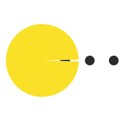

<h1 align="center">Hello world!</h1>

```csharp
jame27-1998@github:~$ man about-me
```
<div>


```

      - ⭐️ Trying to make machines learn through math and code 
      - ✏️ Currently pursuing masters in Machine Learning and Data analytics
      - 🔭 Learning full-stack dev for deploying my ML models 
      - 🚀 Love space and aliens
      - ✨ I like to solve puzzels,play games and read stuff about conspiracy theories
      - 💬 Ask me about anything, I would like to answer.
      
      
```
      
      
   
<hr>

```csharp
jame27-1998@github:~$ tools --help
```


      - Lang : 
            .py   .cpp  .c    .java
      - Database : 
            MySql ,Nosql
      - Tools :
            - ML     : tensorflow,keras,sklearn,sns,mathplotlib,pandas
            - DL     : MLP,CNN,RNN,LSTM,GRU
            - Web    : Html,css,Javascript,Jsp,Servlets,Jdbc,JSON,XML
            
      - OS : 
            Liunx, Windows 10
<hr>

```csharp
jame27-1998@github:~$ profiles --help
```


```


      - DSA : 
            leetcode    : https://leetcode.com/Jame98/
      
      - LinkedIn :
            https://www.linkedin.com/in/james-paul-kurakula-582256125
            
            
```  
<hr>


<hr>
 
      Gif credits  : Borisova Ekaterina https://dribbble.com/BorisovaEkaterina
<!--
#   

<p align="center">
    
</p>
-->
